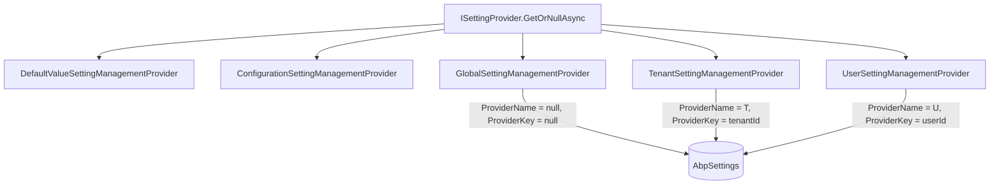
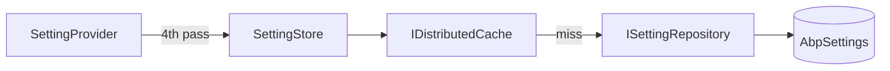
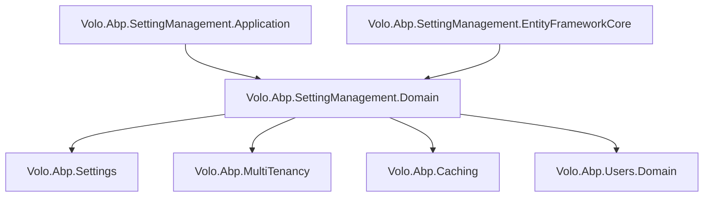

The Setting Management module provides persistent, scoped storage for application settings. It implements ABP's `ISettingStore` interface so that the framework-level `ISettingProvider` resolves setting values from the database with a layered override chain — default → configuration → global → tenant → user — while this module is responsible only for reading and writing the persisted overrides.

## Package Layout

<CardGroup cols={3}>
  <Card title="Domain.Shared" icon="cube">
    `Volo.Abp.SettingManagement.Domain.Shared` — constants, `SettingManagementOptions`, error codes, shared localization
  </Card>
  <Card title="Domain" icon="cube">
    `Volo.Abp.SettingManagement.Domain` — `Setting` entity, `ISettingRepository`, `ISettingManager`, `SettingManager`, `SettingStore`, provider implementations (`GlobalSettingManagementProvider`, `TenantSettingManagementProvider`, `UserSettingManagementProvider`), `DynamicSettingDefinitionStore`, `StaticSettingSaver`
  </Card>
  <Card title="Application.Contracts" icon="cube">
    `Volo.Abp.SettingManagement.Application.Contracts` — `ISettingAppService`, DTOs, permissions
  </Card>
  <Card title="Application" icon="cube">
    `Volo.Abp.SettingManagement.Application` — `SettingAppService` per scope (Email, Timezone, etc.)
  </Card>
  <Card title="HttpApi / HttpApi.Client" icon="cube">
    `Volo.Abp.SettingManagement.HttpApi` — `SettingManagementController` endpoints; `.HttpApi.Client` for proxies
  </Card>
  <Card title="EntityFrameworkCore / MongoDB" icon="database">
    EF Core: `AbpSettingManagementDbContext` with `AbpSettings`, `AbpSettingDefinitionRecords`, `AbpSettingGroupDefinitionRecords` tables
  </Card>
  <Card title="Web / Blazor" icon="browser">
    `Volo.Abp.SettingManagement.Web` — Setting management UI page with pluggable setting groups; `.Blazor`, `.Blazor.Server`, `.Blazor.WebAssembly`, `.Blazor.MudBlazor` variants
  </Card>
</CardGroup>

## Domain Model

### Setting

The sole persistence entity in the module:

```csharp
public class Setting : Entity<Guid>, IAggregateRoot<Guid>
{
    [NotNull]
    public virtual string Name { get; protected set; }         // setting definition name

    [NotNull]
    public virtual string Value { get; internal set; }         // string value

    [CanBeNull]
    public virtual string ProviderName { get; protected set; } // GlobalSettingValueProvider.ProviderName |
                                                               // TenantSettingValueProvider.ProviderName |
                                                               // UserSettingValueProvider.ProviderName | null

    [CanBeNull]
    public virtual string ProviderKey { get; protected set; }  // tenantId | userId | null
}
```

There is no shared `SettingValue` class in the database model — the `Setting` entity is the record. The `SettingValue` DTO type (from `Volo.Abp.Settings`) is used at the application-contract layer only.

The combination `(Name, ProviderName, ProviderKey)` is unique per tenant partition (the table is *not* multi-tenant partitioned by a `TenantId` column — the `ProviderName`/`ProviderKey` combination encodes the scope).

The `GlobalSettingManagementProvider.Name` delegates to `GlobalSettingValueProvider.ProviderName`; similarly for the Tenant and User providers. The actual string values of those provider-name constants are defined in `Volo.Abp.Settings` and are `"G"` (Global), `"T"` (Tenant), and `"U"` (User) respectively.

### SettingDefinitionRecord / SettingGroupDefinitionRecord

Mirror of the Pattern in Permission Management and Feature Management: static setting definitions (declared via `SettingDefinitionProvider`) are persisted to the database by `StaticSettingSaver` at startup. `DynamicSettingDefinitionStore` reads and caches them, enabling microservice-style scenarios where setting definitions are distributed across services but administered centrally.

## ISettingManager (Domain Service)

```csharp
public interface ISettingManager
{
    Task<string> GetOrNullAsync(
        [NotNull] string name,
        [NotNull] string providerName,
        [CanBeNull] string providerKey,
        bool fallback = true);

    Task<List<SettingValue>> GetAllAsync(
        [NotNull] string providerName,
        [CanBeNull] string providerKey,
        bool fallback = true);

    Task SetAsync(
        [NotNull] string name,
        [CanBeNull] string value,
        [NotNull] string providerName,
        [CanBeNull] string providerKey,
        bool forceToSet = false);

    Task DeleteAsync(string providerName, string providerKey);
}
```

- `fallback = true` walks down the provider chain if the requested scope has no value, returning the effective value instead of null.
- `forceToSet = false` (default) avoids writing a value that is identical to the inherited value, keeping the table clean.
- `DeleteAsync(providerName, providerKey)` removes all settings for a given scope at once — used when a tenant is deleted, for example.

## Provider Chain Architecture

Setting resolution goes through `ISettingManagementProvider` implementations, ordered from most-specific to least-specific:



The first non-null value in priority order (User > Tenant > Global > Configuration > Default) wins. When `fallback = false`, only the exact scope is queried.

### Extension Methods by Scope

Convenience extension methods on `ISettingManager` (in `GlobalSettingManagerExtensions`, `TenantSettingManagerExtensions`, `UserSettingManagerExtensions`) hide the raw provider strings:

```csharp
// GlobalSettingManagerExtensions
await settingManager.SetGlobalAsync(SettingName, value);

// TenantSettingManagerExtensions
await settingManager.SetForTenantAsync(tenantId, SettingName, value);

// UserSettingManagerExtensions
await settingManager.SetForCurrentUserAsync(SettingName, value);
await settingManager.SetForUserAsync(userId, SettingName, value);
```

## SettingStore — ISettingStore Implementation

`SettingStore` is this module's implementation of `ISettingStore` from `Volo.Abp.Settings`. The framework-level `SettingProvider` calls it after exhausting default and configuration values:



Cache keys follow the pattern `st:{providerName},{providerKey},{settingName}`. `SettingCacheItemInvalidator` invalidates entries when `Setting` entities are saved or deleted.

## Application Service & HTTP API

The `ISettingAppService` is intentionally thin — it has no direct CRUD on individual settings. Instead, the Web layer registers "setting page contributors" that group settings by category (Email, Timezone, etc.) and each contributor calls focused endpoints:

| Verb | Route | Purpose |
|---|---|---|
| `GET` | `/api/setting-management/emailing` | Get email settings |
| `PUT` | `/api/setting-management/emailing` | Update email settings |
| `GET` | `/api/setting-management/timezone` | Get timezone setting |
| `PUT` | `/api/setting-management/timezone` | Update timezone setting |

<Tip>
To add a new setting group to the management UI, implement `ISettingPageContributor` (for Razor Pages) or `ISettingComponentContributor` (for Blazor) and register it in your module. Your contributor declares which settings it manages and renders the corresponding form.
</Tip>

## Dynamic Setting Definitions

The flow at application startup:

<Steps>
  <Step title="StaticSettingSaver runs">
    On application initialization, `StaticSettingSaver` reads all in-memory `SettingDefinition` objects (from all `ISettingDefinitionProvider` implementations in the DI container) and upserts them into `AbpSettingDefinitionRecords`.
  </Step>
  <Step title="DynamicSettingDefinitionStore caches">
    `DynamicSettingDefinitionStore` loads `AbpSettingDefinitionRecords` from the database and populates `IDynamicSettingDefinitionStoreInMemoryCache`. The in-memory cache is invalidated via a distributed event (`StaticSettingDefinitionChangedEvent`) when any service updates the records.
  </Step>
  <Step title="Setting resolution uses both sources">
    `ISettingDefinitionManager` merges static (in-process) definitions with dynamic (database) definitions. The database copy wins on conflicts, allowing runtime overrides of setting properties like `DisplayName` or `DefaultValue`.
  </Step>
</Steps>

## Module Dependencies



## Integration Points

### Settings Not Stored Here

Not all ABP settings are persisted by this module. The resolution chain includes:
- **DefaultValue** — comes from `SettingDefinition.DefaultValue` in code
- **Configuration** — comes from `appsettings.json` / environment variables via `IConfiguration`

Only values explicitly written through `ISettingManager.SetAsync` land in the `AbpSettings` table. Deleting a record causes the chain to fall back to configuration, then to the definition default.

### Tenant Deletion

When a tenant is deleted, all its `Setting` rows (`ProviderName = "T"`, `ProviderKey = tenantId`) must be cleaned up. The module does not do this automatically — applications should call `ISettingManager.DeleteAsync("T", tenantId.ToString())` in a tenant-delete event handler or the `TenantAppService.DeleteAsync` override.
