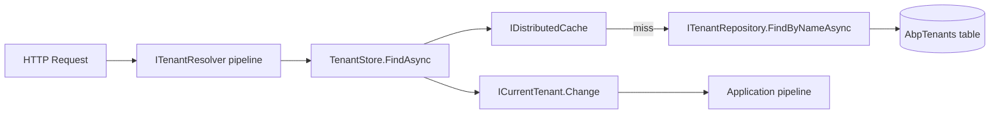
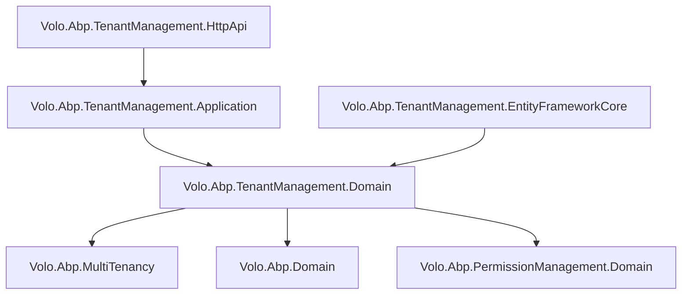

The Tenant Management module owns the *host-side* data model for SaaS tenants. It persists tenant records, per-tenant connection strings, and the normalized names used by the multi-tenancy resolver pipeline. At runtime it feeds `ICurrentTenant` — the ambient tenant-context accessor — and the `ITenantStore` implementation that the framework's multi-tenancy resolution chain queries to load tenant configuration from the database.

## Package Layout

<CardGroup cols={3}>
  <Card title="Domain.Shared" icon="cube">
    `Volo.Abp.TenantManagement.Domain.Shared` — `TenantConsts` (max name length), `TenantManagementErrorCodes`, localization resources
  </Card>
  <Card title="Domain" icon="cube">
    `Volo.Abp.TenantManagement.Domain` — `Tenant`, `TenantConnectionString` entities; `TenantManager`, `TenantStore`, `ITenantRepository`, `ITenantManager`, `TenantConfigurationCacheItemInvalidator`
  </Card>
  <Card title="Application.Contracts" icon="cube">
    `Volo.Abp.TenantManagement.Application.Contracts` — `ITenantAppService`, DTOs, permission definitions (`TenantManagementPermissions`)
  </Card>
  <Card title="Application" icon="cube">
    `Volo.Abp.TenantManagement.Application` — `TenantAppService` implementation
  </Card>
  <Card title="HttpApi / HttpApi.Client" icon="cube">
    `Volo.Abp.TenantManagement.HttpApi` — `TenantController` (`/api/multi-tenancy/tenants`); `.HttpApi.Client` for proxies
  </Card>
  <Card title="EntityFrameworkCore / MongoDB" icon="database">
    EF Core: `AbpTenantManagementDbContext` with `AbpTenants` and `AbpTenantConnectionStrings` tables; MongoDB equivalents
  </Card>
  <Card title="Web / Blazor" icon="browser">
    `Volo.Abp.TenantManagement.Web` — Razor Pages tenant list/create/edit. `.Blazor`, `.Blazor.Server`, `.Blazor.WebAssembly`, `.Blazor.MudBlazor` variants
  </Card>
</CardGroup>

## Domain Model

### Tenant

`Tenant` is a `FullAuditedAggregateRoot<Guid>` that implements `IHasEntityVersion` for optimistic concurrency support:

```csharp
public class Tenant : FullAuditedAggregateRoot<Guid>, IHasEntityVersion
{
    public virtual string Name { get; protected set; }
    public virtual string NormalizedName { get; protected set; }
    public virtual int EntityVersion { get; protected set; }
    public virtual List<TenantConnectionString> ConnectionStrings { get; protected set; }
}
```

Key domain behaviors:

```csharp
// Read the default connection string
public virtual string FindDefaultConnectionString()
    => FindConnectionString(Data.ConnectionStrings.DefaultConnectionStringName);

// Set or update a named connection string (upsert semantics)
public virtual void SetConnectionString(string name, string connectionString)
{
    var existing = ConnectionStrings.FirstOrDefault(x => x.Name == name);
    if (existing != null)
        existing.SetValue(connectionString);
    else
        ConnectionStrings.Add(new TenantConnectionString(Id, name, connectionString));
}
```

`SetName` and `SetNormalizedName` are `protected internal` — mutations go through `TenantManager.ChangeNameAsync` to enforce validation and event publishing.

### TenantConnectionString

Owned entity (one-to-many with `Tenant`):

```csharp
public class TenantConnectionString : Entity
{
    public virtual Guid TenantId { get; protected set; }
    public virtual string Name { get; protected set; }
    public virtual string Value { get; protected set; }
}
```

Multiple named connection strings allow a single tenant to split its data across several databases (e.g., a `Default` DB for transactional data and a separate `Reporting` DB).

## Repository Interface

```csharp
public interface ITenantRepository : IBasicRepository<Tenant, Guid>
{
    Task<Tenant> FindByNameAsync(
        string normalizedName,
        bool includeDetails = true,
        CancellationToken cancellationToken = default);

    Task<List<Tenant>> GetListAsync(
        string sorting = null,
        int maxResultCount = int.MaxValue,
        int skipCount = 0,
        string filter = null,
        bool includeDetails = false,
        CancellationToken cancellationToken = default);

    Task<long> GetCountAsync(
        string filter = null,
        CancellationToken cancellationToken = default);
}
```

`FindByNameAsync` is the hot path for the multi-tenancy resolver — it accepts a pre-normalized name (upper-cased) to use index-friendly comparisons. `includeDetails = true` causes the EF Core query to eager-load `ConnectionStrings`.

## Domain Service: TenantManager

```csharp
public class TenantManager : DomainService, ITenantManager
{
    public virtual async Task<Tenant> CreateAsync(string name)
    {
        var tenant = new Tenant(
            GuidGenerator.Create(),
            name,
            TenantNormalizer.NormalizeName(name));
        await TenantValidator.ValidateAsync(tenant);
        return tenant;
    }

    public virtual async Task ChangeNameAsync(Tenant tenant, string name)
    {
        // Publish event before mutation so listeners see the old normalized name
        await LocalEventBus.PublishAsync(
            new TenantChangedEvent(tenant.Id, tenant.NormalizedName));

        tenant.SetName(name);
        tenant.SetNormalizedName(TenantNormalizer.NormalizeName(name));
        await TenantValidator.ValidateAsync(tenant);
    }
}
```

`AbpTenantValidator` checks that the name is not empty and does not duplicate an existing tenant in `ITenantRepository`. Validation is injected rather than embedded so applications can replace it.

## TenantStore — Connecting to ICurrentTenant

`TenantStore` implements `ITenantStore` from the `Volo.Abp.MultiTenancy` framework package. It is the live adapter between the database and the multi-tenancy resolution pipeline:



`TenantConfigurationCacheItemInvalidator` listens to `EntityChangedEventData<Tenant>` (EF Core change tracker) and deletes the cache entry whenever a tenant record is saved or deleted — ensuring stale configuration does not persist.

## Application Service

`ITenantAppService` exposes standard CRUD plus connection-string management:

```csharp
public interface ITenantAppService : ICrudAppService<
    TenantDto, Guid, GetTenantsInput, TenantCreateDto, TenantUpdateDto>
{
    Task<TenantConnectionStringDto> GetConnectionStringAsync(Guid id, string name);
    Task<ListResultDto<TenantConnectionStringDto>> GetConnectionStringListAsync(Guid id);
    Task<TenantConnectionStringDto> SetConnectionStringAsync(
        Guid id, TenantConnectionStringCreateOrUpdateDto input);
    Task DeleteConnectionStringAsync(Guid id, string name);
}
```

Permission requirements: all tenant write operations require the host-only `TenantManagementPermissions.Tenants.Create/Update/Delete` permissions, which are automatically hidden from tenant-side users.

## HTTP API

The controller is mounted under the `multi-tenancy` remote service area:

| Verb | Route | Purpose |
|---|---|---|
| `GET` | `/api/multi-tenancy/tenants` | Paged tenant list (host only) |
| `GET` | `/api/multi-tenancy/tenants/{id}` | Single tenant |
| `POST` | `/api/multi-tenancy/tenants` | Create tenant |
| `PUT` | `/api/multi-tenancy/tenants/{id}` | Update tenant |
| `DELETE` | `/api/multi-tenancy/tenants/{id}` | Delete tenant |
| `GET` | `/api/multi-tenancy/tenants/{id}/connection-strings/{name}` | Get named connection string |
| `GET` | `/api/multi-tenancy/tenants/{id}/connection-strings` | List all connection strings |
| `PUT` | `/api/multi-tenancy/tenants/{id}/connection-strings` | Create/update connection string |
| `DELETE` | `/api/multi-tenancy/tenants/{id}/connection-strings/{name}` | Remove connection string |

<Warning>
These endpoints must only be accessible to host-level administrators. They are excluded from tenant-scoped routing by ABP's multi-tenancy middleware — do not expose them without the correct permission guards.
</Warning>

## Module Dependencies



## Integration Points

### ICurrentTenant Interaction

When a request arrives with a tenant identifier (via subdomain, header, query-string, or cookie — resolved by `ITenantResolveContributor` implementations), the framework calls `ITenantStore.FindAsync(name)` to get a `TenantConfiguration` object. It then calls `ICurrentTenant.Change(tenantId)` via `IAbpApplication.SetCurrentTenant`, making the `TenantId` available throughout the request to repositories and services that implement `IMultiTenant`.

### Events Published

`TenantChangedEvent` (local) is published by `TenantManager.ChangeNameAsync` before the name mutation, carrying the old normalized name. Downstream modules that cache tenant data (e.g., `IdentityDynamicClaimsPrincipalContributorCache`) can listen to this event to invalidate their caches.

### Data Seeding

`TenantManagementDataSeedContributor` is not part of the module itself — each application provides its own data seed contributor that calls `ITenantAppService` or `TenantManager` directly to create initial tenants during `DbMigrator` execution.
