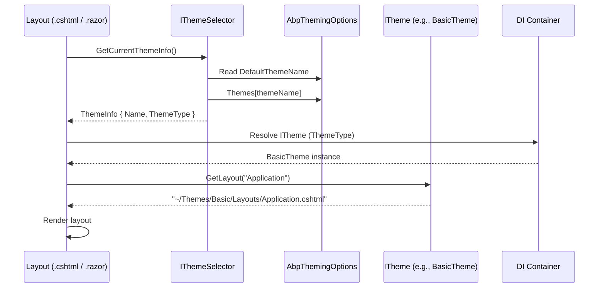

ABP's theming system provides a clean separation between the application's HTML/CSS chrome and the business logic rendered inside it. Themes are swappable implementations of `ITheme`, selected at runtime by `IThemeSelector`. Modules contribute menu items and toolbar buttons through contributor interfaces without taking a direct dependency on any theme implementation.

## MVC Theme Abstraction

### ITheme

```csharp
// Volo.Abp.AspNetCore.Mvc.UI.Theming
namespace Volo.Abp.AspNetCore.Mvc.UI.Theming;

public interface ITheme
{
    string GetLayout(string name, bool fallbackToDefault = true);
}
```

`GetLayout` returns a **Razor view path** (`~/Themes/Basic/Layouts/Application.cshtml`) for a named layout. The `name` parameter is one of the constants defined in `StandardLayouts`:

```csharp
public static class StandardLayouts
{
    public const string Application = "Application"; // Main authenticated layout
    public const string Account     = "Account";     // Login, register, password reset
    public const string Public      = "Public";      // Public-facing pages
    public const string Empty       = "Empty";       // Minimal, no chrome
}
```

When `fallbackToDefault = true` and the requested layout name is unknown, `GetLayout` returns the Application layout path instead of throwing.

### IThemeSelector

```csharp
public interface IThemeSelector
{
    ThemeInfo GetCurrentThemeInfo();
}
```

`ThemeInfo` contains the theme name and the `ITheme` implementation type. ABP's default implementation (`DefaultThemeSelector`) reads `AbpThemingOptions.DefaultThemeName` and resolves the corresponding implementation from DI.

Custom `IThemeSelector` implementations can select themes based on tenant preference, user settings, or any other runtime criteria:

```csharp
public class TenantBasedThemeSelector : IThemeSelector, ITransientDependency
{
    public ThemeInfo GetCurrentThemeInfo()
    {
        // Read from tenant settings, return appropriate ThemeInfo
    }
}
```

### AbpThemingOptions

```csharp
public class AbpThemingOptions
{
    public ThemeDictionary Themes { get; }      // All registered themes
    public string? DefaultThemeName { get; set; }
    public string? BaseUrl { get; set; }        // Adds <base href="..."> to page head
}
```

Themes register themselves in `ConfigureServices`:

```csharp
Configure<AbpThemingOptions>(options =>
{
    options.Themes.Add<BasicTheme>();
    if (options.DefaultThemeName == null)
        options.DefaultThemeName = BasicTheme.Name;
});
```

`ThemeDictionary` is keyed by `ThemeNameAttribute.Name` on the theme class (e.g., `"Basic"`).

## Blazor Theme Abstraction

The Blazor theme system uses a parallel interface in `Volo.Abp.AspNetCore.Components.Web.Theming`:

```csharp
// Returns a Type (Razor component type) rather than a view path string
public interface ITheme
{
    Type GetLayout(string name, bool fallbackToDefault = true);
}

public interface IThemeSelector
{
    ThemeInfo GetCurrentThemeInfo();
}

public class AbpThemingOptions
{
    public ThemeDictionary Themes { get; }
    public string? DefaultThemeName { get; set; }
}
```

The key difference: Blazor's `ITheme.GetLayout` returns a `Type` (a `LayoutComponentBase` subclass like `MainLayout`) rather than a file path, because Blazor resolves layouts by type at render time.

### Blazor Standard Layouts

```csharp
// Volo.Abp.AspNetCore.Components.Web.Theming.Layout
public static class StandardLayouts
{
    public const string Application = "Application";
    public const string Account     = "Account";
    public const string Public      = "Public";
    public const string Empty       = "Empty";
}
```

These constants are identical to the MVC equivalents, ensuring consistent naming across platforms.

## IPageLayout (MVC)

```csharp
public interface IPageLayout
{
    ContentLayout Content { get; }
}
```

`IPageLayout` is a request-scoped service that allows Razor Pages and MVC views to communicate with the layout. The `ContentLayout` typically exposes:
- `Title` — the page `<title>` and breadcrumb heading
- `MenuItemName` — which menu item should appear active in the navigation

Usage in a Razor Page:

```razor
@inject IPageLayout PageLayout

@{
    PageLayout.Content.Title = "Books";
    PageLayout.Content.MenuItemName = "BooksManagement.Books";
}
```

The layout reads these properties to render dynamic titles and highlight the correct navigation item.

## Toolbar System

### IToolbarContributor

```csharp
public interface IToolbarContributor
{
    Task ConfigureToolbarAsync(IToolbarConfigurationContext context);
}
```

```csharp
public class AbpToolbarOptions
{
    public List<IToolbarContributor> Contributors { get; }
}
```

Modules register toolbar contributors in `ConfigureServices`:

```csharp
Configure<AbpToolbarOptions>(options =>
{
    options.Contributors.Add(new BasicThemeMainTopToolbarContributor());
});
```

`IToolbarConfigurationContext` provides access to the current `IServiceProvider`, allowing contributors to check permissions or feature flags before adding items:

```csharp
public class BasicThemeMainTopToolbarContributor : IToolbarContributor
{
    public async Task ConfigureToolbarAsync(IToolbarConfigurationContext context)
    {
        if (await context.IsGrantedAsync("MyApp.Admin"))
        {
            context.Toolbar.Items.Add(new ToolbarItem(typeof(AdminMenuComponent)));
        }
    }
}
```

### Standard Toolbars

```csharp
// StandardToolbars defines well-known toolbar positions
public static class StandardToolbars
{
    public const string Main = "Main"; // Top navigation bar
}
```

The layout renders the `Main` toolbar's items in the top navigation area. Custom toolbars can be added for other positions (sidebar, footer, etc.).

### IToolbarManager

`IToolbarManager` resolves and executes all registered contributors for a given toolbar name:

```csharp
var toolbar = await ToolbarManager.GetAsync(StandardToolbars.Main);
// toolbar.Items contains all contributed ToolbarItem objects
```

Items are `ToolbarItem` instances that hold a `ViewComponentType` (MVC) or component `Type` (Blazor). The layout iterates them and invokes each as a view component or Blazor component.

## Page Toolbar System

The page toolbar is distinct from the main toolbar — it renders action buttons at the top of a specific page (e.g., "New Book", "Export"):

```csharp
public class AbpPageToolbarOptions
{
    // Dictionary<pageName, PageToolbarContributorList>
    public PageToolbarDictionary Toolbars { get; }
}

public interface IPageToolbarContributor
{
    Task ContributeAsync(PageToolbarContributionContext context);
}
```

Pages register contributors by page name:

```csharp
Configure<AbpPageToolbarOptions>(options =>
{
    options.Configure<BooksPageToolbarContributor>("Books");
});
```

`PageToolbarContributionContext` exposes `ServiceProvider`, `PageName`, and the `Items` list to which components are added.

## Menu System

### IMenuContributor

```csharp
public interface IMenuContributor
{
    Task ConfigureMenuAsync(MenuConfigurationContext context);
}
```

Modules contribute menu items by implementing `IMenuContributor` and registering in `AbpNavigationOptions`:

```csharp
Configure<AbpNavigationOptions>(options =>
{
    options.MenuContributors.Add(new BookStoreMenuContributor());
});
```

`MenuConfigurationContext` provides the `ServiceProvider` and the `Menu` to which items are added:

```csharp
public class BookStoreMenuContributor : IMenuContributor
{
    public async Task ConfigureMenuAsync(MenuConfigurationContext context)
    {
        if (context.Menu.Name != StandardMenus.Main) return;

        if (!await context.IsGrantedAsync(BookStorePermissions.Books.Default)) return;

        context.Menu.AddItem(
            new ApplicationMenuItem(
                "BooksManagement",
                "Books",
                url: "/books",
                icon: "fa fa-book",
                order: 2
            )
        );
    }
}
```

### Standard Menus

```csharp
public static class StandardMenus
{
    public const string Main        = "Main";        // Primary navigation
    public const string User        = "User";        // User dropdown (profile, logout)
    public const string ProfileSide = "ProfileSide"; // Profile page sidebar
}
```

`IMenuManager` collects contributions from all registered `IMenuContributor` implementations, sorts items by `Order`, and returns the composed `ApplicationMenu` tree.

## Theme Selection Flow



## Extending the Theme

Themes are meant to be extended through:

1. **Menu contributors** — add items to `StandardMenus.Main` without touching theme code.
2. **Toolbar contributors** — add components to `StandardToolbars.Main`.
3. **Page toolbar contributors** — add page-level action buttons.
4. **`AbpThemingOptions.Themes.Add<T>()`** — register a completely custom theme.
5. **Bundle contributors** — add custom CSS/JS to the theme's global bundles (see bundling docs).
6. **Virtual File System overrides** — override specific layout `.cshtml` files by placing a physical file at the same virtual path (works because physical files take precedence over embedded resources in ABP's VFS).
