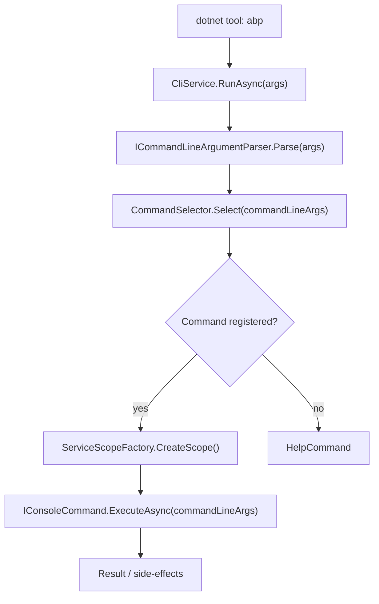

The ABP CLI (`Volo.Abp.Cli`) is a .NET global tool distributed as the `Volo.Abp.Cli` NuGet package. When a developer runs `abp new`, `abp add-module`, or any other command, execution flows through a small but well-structured pipeline: `CliService` parses the raw `string[]` arguments, delegates type resolution to `CommandSelector`, creates a DI scope, and invokes the selected `IConsoleCommand` implementation. Every part of that pipeline is replaceable through standard ABP options configuration.

## Architecture overview



<CardGroup cols={2}>
  <Card title="CliService" icon="terminal">
    Top-level orchestrator. Handles version checks, telemetry, `batch` mode, and `prompt` (REPL) mode.
  </Card>
  <Card title="CommandSelector" icon="code-branch">
    Looks up the command name in `AbpCliOptions.Commands` and returns the matching `Type`.
  </Card>
  <Card title="IConsoleCommand" icon="plug">
    Contract every command must implement: `ExecuteAsync` and `GetUsageInfo`.
  </Card>
  <Card title="AbpCliCoreModule" icon="cubes">
    The ABP module that wires all built-in commands and service-proxy generators into the DI container.
  </Card>
</CardGroup>

## `CliService` — the entry point

`CliService` is registered as `ITransientDependency`. Its constructor receives the fundamental collaborators via DI:

```csharp
// framework/src/Volo.Abp.Cli.Core/Volo/Abp/Cli/CliService.cs
public class CliService : ITransientDependency
{
    protected ICommandLineArgumentParser CommandLineArgumentParser { get; }
    protected ICommandSelector CommandSelector { get; }
    protected IServiceScopeFactory ServiceScopeFactory { get; }
    protected PackageVersionCheckerService PackageVersionCheckerService { get; }
    protected CliVersionService CliVersionService { get; }
    public ICmdHelper CmdHelper { get; }
    // ...
}
```

`RunAsync(string[] args)` is the single public method:

1. **Parse** — `ICommandLineArgumentParser.Parse(args)` turns the raw argument array into a structured `CommandLineArgs` (command name + options dictionary).
2. **Version banner** — prints `ABP CLI {currentCliVersion}` unless the command is `mcp` (to avoid corrupting the JSON-RPC stdout stream).
3. **Version check** — in non-DEBUG builds, calls `CheckCliVersionAsync` at most once per day (guarded by a `MemoryService` timestamp). Detects `Stable`, `Prerelease`, and `Nightly` channels based on the semver pre-release label.
4. **Dispatch** — handles three special top-level modes before falling through to `RunInternalAsync`:
   - `prompt` → interactive REPL loop via `RunPromptAsync`
   - `batch` → reads a text file and executes each non-comment line via `RunBatchAsync`
   - everything else → `RunInternalAsync`

```csharp
private async Task RunInternalAsync(CommandLineArgs commandLineArgs)
{
    var commandType = CommandSelector.Select(commandLineArgs);

    using (var scope = ServiceScopeFactory.CreateScope())
    {
        var command = (IConsoleCommand)scope.ServiceProvider.GetRequiredService(commandType);
        await command.ExecuteAsync(commandLineArgs);
    }
}
```

Each command runs in its own DI scope so transient and scoped services are properly disposed after execution.

### Update channel detection

`CliService` inspects the running semver to select the NuGet feed for the version check:

| Pre-release label | Channel | Feed |
|---|---|---|
| _(none)_ | `Stable` | NuGet.org `Volo.Abp.Cli` |
| `preview` | `Nightly` | MyGet nightly feed |
| `dev` | `Development` | _(skipped)_ |
| anything else pre-release | `Prerelease` | NuGet.org `Volo.Abp.Cli` (pre-release) |

The logic in source is: if `currentCliVersion.Release.Contains("preview")` → `Nightly`; if contains `"dev"` → `Development`; otherwise any pre-release → `Prerelease`.

## `IConsoleCommand` — the command contract

```csharp
// framework/src/Volo.Abp.Cli.Core/Volo/Abp/Cli/Commands/IConsoleCommand.cs
public interface IConsoleCommand
{
    Task ExecuteAsync(CommandLineArgs commandLineArgs);
    string GetUsageInfo();
}
```

Every command implements both members. `GetUsageInfo()` returns a multi-line help string that is printed by `HelpCommand` and on `CliUsageException`. Commands also typically declare a `public const string Name` and a `static string GetShortDescription()` by convention, though neither is part of the interface.

### `CommandLineArgs` structure

`ICommandLineArgumentParser` turns `string[]` into:

| Property | Example |
|---|---|
| `Command` | `"new"` |
| `Target` | `"Acme.BookStore"` |
| `Options` | `{ "template": "app", "ui": "angular" }` |

## `CommandSelector`

```csharp
// framework/src/Volo.Abp.Cli.Core/Volo/Abp/Cli/Commands/CommandSelector.cs
public class CommandSelector : ICommandSelector, ITransientDependency
{
    protected AbpCliOptions Options { get; }

    public Type Select(CommandLineArgs commandLineArgs)
    {
        if (commandLineArgs.Command.IsNullOrWhiteSpace())
        {
            return typeof(HelpCommand);
        }

        return Options.Commands.GetOrDefault(commandLineArgs.Command)
               ?? typeof(HelpCommand);
    }
}
```

The lookup is case-insensitive (`StringComparer.OrdinalIgnoreCase` is set on the dictionary in `AbpCliOptions`). Unknown commands silently fall back to `HelpCommand`, which prints the usage list.

## `AbpCliOptions` — the command registry

```csharp
// framework/src/Volo.Abp.Cli.Core/Volo/Abp/Cli/AbpCliOptions.cs
public class AbpCliOptions
{
    public Dictionary<string, Type> Commands { get; }
    public List<string> DisabledModulesToAddToSolution { get; set; }
    public bool CacheTemplates { get; set; } = true;
    public string ToolName { get; set; } = "CLI";
    public bool AlwaysHideExternalCommandOutput { get; set; }
}
```

`Commands` maps string keys (the literal CLI token) to `IConsoleCommand` implementation types. Any downstream module can extend the CLI by calling:

```csharp
Configure<AbpCliOptions>(options =>
{
    options.Commands["my-command"] = typeof(MyCustomCommand);
});
```

## `AbpCliCoreModule` — wiring everything together

`AbpCliCoreModule` depends on `AbpDddDomainModule`, `AbpJsonModule`, `AbpIdentityModelModule`, `AbpMinifyModule`, `AbpHttpModule`, and `AbpLocalizationModule`. Its `ConfigureServices` registers all built-in commands:

```csharp
// framework/src/Volo.Abp.Cli.Core/Volo/Abp/Cli/AbpCliCoreModule.cs
Configure<AbpCliOptions>(options =>
{
    options.Commands[HelpCommand.Name]                              = typeof(HelpCommand);
    options.Commands[PromptCommand.Name]                            = typeof(PromptCommand);
    options.Commands[NewCommand.Name]                               = typeof(NewCommand);
    options.Commands[GetSourceCommand.Name]                         = typeof(GetSourceCommand);
    options.Commands[UpdateCommand.Name]                            = typeof(UpdateCommand);
    options.Commands[AddPackageCommand.Name]                        = typeof(AddPackageCommand);
    options.Commands[AddModuleCommand.Name]                         = typeof(AddModuleCommand);
    options.Commands[ListModulesCommand.Name]                       = typeof(ListModulesCommand);
    options.Commands[ListTemplatesCommand.Name]                     = typeof(ListTemplatesCommand);
    options.Commands[LoginCommand.Name]                             = typeof(LoginCommand);
    options.Commands[LoginInfoCommand.Name]                         = typeof(LoginInfoCommand);
    options.Commands[LogoutCommand.Name]                            = typeof(LogoutCommand);
    options.Commands[GenerateProxyCommand.Name]                     = typeof(GenerateProxyCommand);
    options.Commands[RemoveProxyCommand.Name]                       = typeof(RemoveProxyCommand);
    options.Commands[SuiteCommand.Name]                             = typeof(SuiteCommand);
    options.Commands[SwitchToPreviewCommand.Name]                   = typeof(SwitchToPreviewCommand);
    options.Commands[SwitchToStableCommand.Name]                    = typeof(SwitchToStableCommand);
    options.Commands[SwitchToNightlyCommand.Name]                   = typeof(SwitchToNightlyCommand);
    options.Commands[SwitchToPreRcCommand.Name]                     = typeof(SwitchToPreRcCommand);
    options.Commands[SwitchToLocal.Name]                            = typeof(SwitchToLocal);
    options.Commands[TranslateCommand.Name]                         = typeof(TranslateCommand);
    options.Commands[BuildCommand.Name]                             = typeof(BuildCommand);
    options.Commands[BundleCommand.Name]                            = typeof(BundleCommand);
    options.Commands[CreateMigrationAndRunMigratorCommand.Name]     = typeof(CreateMigrationAndRunMigratorCommand);
    options.Commands[InstallLibsCommand.Name]                       = typeof(InstallLibsCommand);
    options.Commands[CleanCommand.Name]                             = typeof(CleanCommand);
    options.Commands[CliCommand.Name]                               = typeof(CliCommand);
    options.Commands[ClearDownloadCacheCommand.Name]                = typeof(ClearDownloadCacheCommand);
    options.Commands[RecreateInitialMigrationCommand.Name]          = typeof(RecreateInitialMigrationCommand);
    options.Commands[GenerateRazorPage.Name]                        = typeof(GenerateRazorPage);
    options.Commands[McpCommand.Name]                               = typeof(McpCommand);
    options.Commands[GenerateJwksCommand.Name]                      = typeof(GenerateJwksCommand);

    options.DisabledModulesToAddToSolution.Add("Volo.Abp.LeptonXTheme.Pro");
    options.DisabledModulesToAddToSolution.Add("Volo.Abp.LeptonXTheme.Lite");
});
```

It also registers the three built-in service-proxy generators:

```csharp
Configure<AbpCliServiceProxyOptions>(options =>
{
    options.Generators[JavaScriptServiceProxyGenerator.Name] = typeof(JavaScriptServiceProxyGenerator);
    options.Generators[AngularServiceProxyGenerator.Name]    = typeof(AngularServiceProxyGenerator);
    options.Generators[CSharpServiceProxyGenerator.Name]     = typeof(CSharpServiceProxyGenerator);
});
```

## Authentication (`LoginCommand`)

`LoginCommand` delegates to `AuthService`, which stores an OAuth access token locally. Three login flows are supported:

| Flow | Invocation | Notes |
|---|---|---|
| Username + password | `abp login <user> -p <pass>` | Prompts if `-p` is omitted |
| Multi-org | `abp login <user> --organization <org>` | Required when the account belongs to multiple organizations |
| Device code | `abp login --device` | Opens a browser; required for accounts with 2FA |

The stored token is consumed by `TemplateProjectBuilder` when downloading Pro template archives and by `GetSourceCommand` when downloading Pro module source code.

## Plugin / extensibility model

Because `AbpCliOptions.Commands` is a plain dictionary configured through the standard ABP `Configure<TOptions>` pattern, any ABP module loaded into the host application can add, replace, or remove commands. ABP Suite (`SuiteCommand`) is an example of a command that ships in a separate NuGet package but plugs into the same dispatch mechanism.

<Note>
The `HideFromCommandList` attribute (in the `Commands/Internal` sub-namespace) suppresses a command from the `help` output while still registering it normally. `RecreateInitialMigrationCommand` and `CreateMigrationAndRunMigratorCommand` use this to hide internal tooling commands from end users.
</Note>

<Tip>
To inspect what commands are registered at runtime, resolve `IOptions<AbpCliOptions>` and enumerate `.Value.Commands.Keys`. This is also how `HelpCommand` generates its list.
</Tip>
