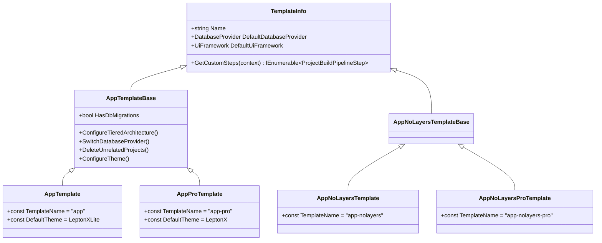
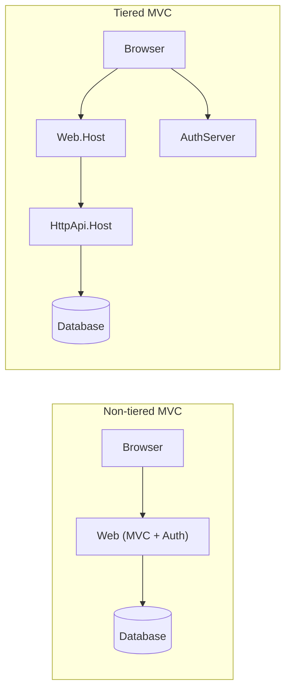

The `app` startup template is the default choice when running `abp new`. It produces a full layered solution following Clean Architecture: Domain, Application, HTTP API, UI, and infrastructure projects are separate assemblies. A lighter `app-nolayers` variant collapses all layers into a single project. Both are implemented as `TemplateInfo` subclasses in `Volo.Abp.Cli.Core` and are driven through a `ProjectBuildPipeline` that selectively removes, renames, and rewrites files before zipping the result for extraction on disk.

## Template class hierarchy



`AppTemplate` is registered with `TemplateName = "app"` and `DefaultTheme = Theme.LeptonXLite`. Its `DocumentUrl` points to `https://abp.io/docs/latest/solution-templates/layered-web-application`.

## `app` template — project structure

The template ZIP contains all possible project variants under `templates/app/aspnet-core/src/`. The `ProjectBuildPipeline` removes unneeded projects based on the chosen UI framework, database provider, and topology flags.

### Core layer projects

| Project folder | Purpose |
|---|---|
| `MyCompanyName.MyProjectName.Domain.Shared` | Enums, constants, and value objects shared between Domain and Application.Contracts layers; no external dependencies |
| `MyCompanyName.MyProjectName.Domain` | Entities, domain services, repositories (interfaces only), domain events; references `Domain.Shared` |
| `MyCompanyName.MyProjectName.Application.Contracts` | Application service interfaces + DTOs; references `Domain.Shared` |
| `MyCompanyName.MyProjectName.Application` | Application service implementations; references `Domain` and `Application.Contracts` |
| `MyCompanyName.MyProjectName.HttpApi` | MVC Controllers that wrap Application services as REST endpoints |
| `MyCompanyName.MyProjectName.HttpApi.Client` | Dynamic HTTP client proxy to consume the HttpApi remotely; references `Application.Contracts` |

### Infrastructure & host projects

| Project folder | Purpose |
|---|---|
| `MyCompanyName.MyProjectName.EntityFrameworkCore` | EF Core `DbContext`, repository implementations, migrations |
| `MyCompanyName.MyProjectName.MongoDB` | MongoDB repository implementations (present in template; removed when EF Core is selected) |
| `MyCompanyName.MyProjectName.DbMigrator` | Console app that runs EF Core migrations and seeds initial data |
| `MyCompanyName.MyProjectName.HttpApi.Host` | ASP.NET Core host for the API layer (non-tiered: merged with auth) |
| `MyCompanyName.MyProjectName.HttpApi.HostWithIds` | API host with integrated OpenIddict identity server (tiered/Angular source) — renamed to `HttpApi.Host` post-pipeline |
| `MyCompanyName.MyProjectName.AuthServer` | Separate OpenIddict authentication server (tiered configurations only) |

### UI projects (all present in ZIP; pipeline removes unneeded ones)

| Project | UI framework |
|---|---|
| `MyCompanyName.MyProjectName.Web` | MVC / Razor Pages (non-tiered) |
| `MyCompanyName.MyProjectName.Web.Host` | MVC / Razor Pages (tiered, connects to separate API host) |
| `MyCompanyName.MyProjectName.Blazor` | Blazor WebAssembly client |
| `MyCompanyName.MyProjectName.Blazor.Client` | Blazor WebAssembly client sub-project (interactive render mode) |
| `MyCompanyName.MyProjectName.Blazor.Server` | Blazor Server (non-tiered) |
| `MyCompanyName.MyProjectName.Blazor.Server.Tiered` | Blazor Server (tiered) — renamed to `Blazor` by pipeline |
| `MyCompanyName.MyProjectName.Blazor.WebApp` | Blazor Web App (non-tiered) |
| `MyCompanyName.MyProjectName.Blazor.WebApp.Client` | Blazor Web App WASM client (non-tiered) |
| `MyCompanyName.MyProjectName.Blazor.WebApp.Tiered` | Blazor Web App (tiered) |
| `MyCompanyName.MyProjectName.Blazor.WebApp.Tiered.Client` | Blazor Web App WASM client (tiered) |
| `MyCompanyName.MyProjectName.MauiBlazor` | MAUI Blazor hybrid app |
| `/angular/` | Angular SPA (top-level folder, not a `.csproj`) |

<Note>
The `/react-native/` folder (mobile) is also present and removed unless `--mobile react-native` is passed.
</Note>

## Tiered vs non-tiered topology

The `--tiered` flag adds `"tiered"` to `ProjectBuildArgs.ExtraProperties`. `AppTemplateBase.ConfigureTieredArchitecture` adds the `tiered` symbol to `ProjectBuildContext.Symbols`, and then `DeleteUnrelatedProjects` / `ConfigureWithMvcUi` (etc.) decide which projects survive.



The key project-level decisions per UI framework:

| UI | Non-tiered keeps | Tiered keeps |
|---|---|---|
| MVC | `Web` | `Web.Host`, `HttpApi.Host`, `AuthServer` |
| Angular | `HttpApi.Host` (renamed from `HostWithIds`) | `HttpApi.Host`, `AuthServer` |
| Blazor WASM | `Blazor`, `HttpApi.Host` (renamed from `HostWithIds`) | `Blazor`, `HttpApi.Host`, `AuthServer` |
| Blazor Server | `Blazor` (renamed from `Blazor.Server`) | `Blazor` (renamed from `Blazor.Server.Tiered`) + `AuthServer` |
| Blazor WebApp | `Blazor` + `Blazor.Client` (renamed) | `Blazor` + `Blazor.Client` (tiered, renamed) + `AuthServer` |

## Database provider switching

`AppTemplateBase.SwitchDatabaseProvider` inspects `ProjectBuildArgs.DatabaseProvider`:

```csharp
if (context.BuildArgs.DatabaseProvider == DatabaseProvider.MongoDb)
{
    steps.Add(new AppTemplateSwitchEntityFrameworkCoreToMongoDbStep(HasDbMigrations));
}

if (context.BuildArgs.DatabaseProvider != DatabaseProvider.EntityFrameworkCore)
{
    steps.Add(new RemoveProjectFromSolutionStep("MyCompanyName.MyProjectName.EntityFrameworkCore"));
    steps.Add(new RemoveProjectFromSolutionStep("MyCompanyName.MyProjectName.EntityFrameworkCore.DbMigrations"));
    // ...
}
```

For EF Core, the DBMS symbol (`SqlServer`, `MySql`, `PostgreSql`, `Oracle`, `SqLite`) is added to `ProjectBuildContext.Symbols` so `TemplateCodeDeleteStep` can remove DBMS-specific code blocks wrapped in `<!--#if SqlServer-->` / `<!--#endregion-->` style markers.

## `ProjectBuildPipeline` — how template substitution works

`TemplateProjectBuilder.BuildAsync` constructs a `ProjectBuildContext` and then calls:

```csharp
TemplateProjectBuildPipelineBuilder.Build(context).Execute();
```

`Build` constructs a `ProjectBuildPipeline` and populates its `Steps` list in a fixed order:

<Steps>
  <Step title="FileEntryListReadStep">
    Reads all files from the template ZIP into an in-memory `FileEntryList`. All subsequent steps operate on this list, never on disk.
  </Step>
  <Step title="CreateAppSettingsSecretsStep">
    For templates newer than v4.3.99, separates sensitive `appsettings` keys into `appsettings.secrets.json`.
  </Step>
  <Step title="Template custom steps (AppTemplateBase.GetCustomSteps)">
    The ordered set of steps contributed by the concrete template class. This is where projects are removed, ports are randomised, themes are swapped, migrations are stripped, and the connection string is replaced.
  </Step>
  <Step title="ProjectReferenceReplaceStep">
    Converts local `&lt;ProjectReference&gt;` entries in `.csproj` files to `&lt;PackageReference&gt;` entries pointing to published NuGet packages (unless `--local-framework-ref` was passed).
  </Step>
  <Step title="TemplateCodeDeleteStep">
    Removes blocks of code enclosed in template-conditional markers based on the active symbol set (e.g., `EFCORE`, `SqlServer`, `tiered`, `ui:angular`).
  </Step>
  <Step title="SolutionRenameStep">
    Runs `SolutionRenamer` which replaces every occurrence of `MyCompanyName.MyProjectName` with the actual solution name across all file contents and paths.
  </Step>
  <Step title="DatabaseManagementSystemChangeStep">
    Patches connection string format in `appsettings.json` files for the chosen DBMS.
  </Step>
  <Step title="RemoveRootFolderStep">
    Flattens the `/aspnet-core/` root folder when Angular is not used.
  </Step>
  <Step title="CheckRedisPreRequirements">
    Adds `PreRequirements:Redis` to `ExtraProperties` if the template includes Redis so `NewCommand` can warn post-creation.
  </Step>
  <Step title="CreateProjectResultZipStep">
    Re-zips the mutated `FileEntryList` into the `ProjectResult.ZipContent` byte array returned to `NewCommand`.
  </Step>
</Steps>

### Key pipeline step types

| Step class | What it does |
|---|---|
| `RemoveProjectFromSolutionStep` | Removes a `.csproj` reference from the `.sln` file and the project's folder from the file list |
| `TemplateProjectRenameStep` | Renames a project within the solution (both the folder path and the project name) |
| `MoveFolderStep` | Re-roots an entire directory path within the file list |
| `RemoveFolderStep` | Deletes all entries under a given path prefix |
| `SolutionRenameStep` | Global find-and-replace of `MyCompanyName.MyProjectName` across all files |
| `TemplateRandomSslPortStep` | Randomises the `https://localhost:443xx` ports to avoid collisions between concurrently running solutions |
| `RandomizeStringEncryptionStep` | Generates a unique `StringEncryptionDefaultPassPhrase` value |
| `ChangeThemeStep` | Swaps theme NuGet package references throughout `.csproj` files |
| `ConnectionStringChangeStep` | Replaces the default connection string with the value from `--connection-string` |

## `app-nolayers` template

The `app-nolayers` template (`AppNoLayersTemplate`, `TemplateName = "app-nolayers"`) collapses all layers into a single project. The template ZIP contains parallel EF Core and MongoDB variants:

| Folder | Description |
|---|---|
| `MyCompanyName.MyProjectName.Mvc` | Single-project MVC app with EF Core |
| `MyCompanyName.MyProjectName.Mvc.Mongo` | Single-project MVC app with MongoDB |
| `MyCompanyName.MyProjectName.Host` | API-only host (for Angular) with EF Core |
| `MyCompanyName.MyProjectName.Host.Mongo` | API-only host (for Angular) with MongoDB |
| `MyCompanyName.MyProjectName.Blazor.Server` | Blazor Server single-project with EF Core |
| `MyCompanyName.MyProjectName.Blazor.Server.Mongo` | Blazor Server single-project with MongoDB |
| `MyCompanyName.MyProjectName.Blazor.WebAssembly/` | Blazor WASM with Server + Client sub-projects |

`AppNoLayersTemplateBase.SwitchDatabaseProvider` removes the EF Core variants when MongoDB is selected (and vice versa) and renames the surviving project to the plain `MyCompanyName.MyProjectName` name. Migrations are removed from both the `MyCompanyName.MyProjectName` and `MyCompanyName.MyProjectName.Host` folders since they are re-generated after `abp new` completes.

<Tip>
Use `app-nolayers` for rapid prototypes or microservices with a small footprint. The pipeline still supports the full UI-framework matrix (MVC, Blazor Server, Blazor WASM, Angular) and the EF Core vs MongoDB choice.
</Tip>

## Template source cache

`ISourceCodeStore` (implemented by `AbpIoSourceCodeStore`) caches downloaded template ZIPs in the local user profile. The cache is keyed by template name and version. Pass `--skip-cache` (or `-sc`) to force a fresh download. `AbpCliOptions.CacheTemplates = true` enables caching by default.
