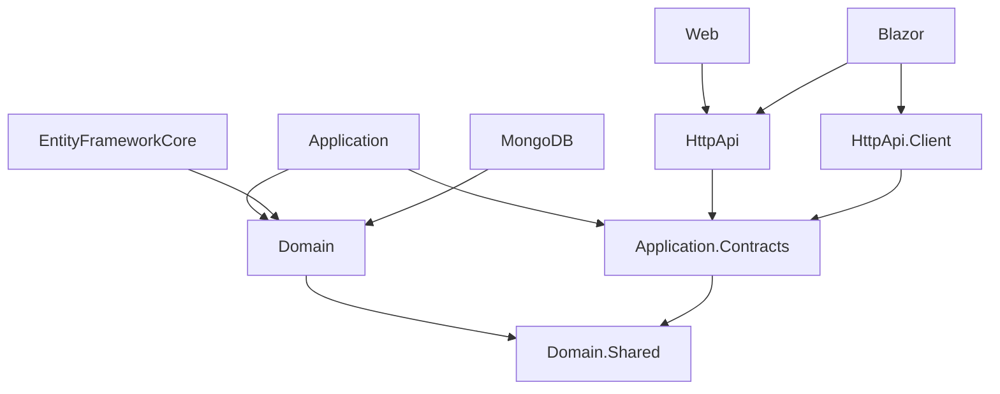

The `module` startup template produces a distributable ABP module — a self-contained NuGet package suite that can be installed into any ABP application. Unlike the `app` template, which produces a runnable solution, the `module` template produces a library solution with accompanying host applications used only during development and testing. The template is implemented by `ModuleTemplate` / `ModuleTemplateBase` in `Volo.Abp.Cli.Core` and goes through the same `ProjectBuildPipeline` as the app template, with its own set of custom pipeline steps.

## Template class

```csharp
// framework/src/Volo.Abp.Cli.Core/Volo/Abp/Cli/ProjectBuilding/Templates/MvcModule/ModuleTemplate.cs
public class ModuleTemplate : ModuleTemplateBase
{
    public const string TemplateName = "module";

    public ModuleTemplate()
        : base(TemplateName)
    {
        DocumentUrl = "https://abp.io/docs/latest/solution-templates/application-module";
    }
}
```

`ModuleTemplateBase` extends the abstract `TemplateInfo` base class and overrides `GetCustomSteps` to configure the pipeline for module-specific concerns.

## Project structure

The template ZIP is organised under `templates/module/aspnet-core/` with three top-level sub-directories: `src/`, `test/`, and `host/`.

### Source packages (`src/`)

These are the projects that get published to NuGet and consumed by host applications.

<CardGroup cols={2}>
  <Card title="Domain.Shared" icon="share-nodes">
    Enums, constants, value objects, and localization resources. Has no dependency on any other module project. Safe to reference from any layer.
  </Card>
  <Card title="Domain" icon="database">
    Entities, aggregate roots, domain services, repository interfaces, and domain events. References `Domain.Shared`.
  </Card>
  <Card title="Application.Contracts" icon="file-contract">
    Application service interfaces and DTOs. References `Domain.Shared`. This is the "public API" of the module.
  </Card>
  <Card title="Application" icon="gears">
    Application service implementations. References `Domain` and `Application.Contracts`.
  </Card>
  <Card title="HttpApi" icon="globe">
    ASP.NET Core controllers that expose `Application.Contracts` as REST endpoints. References `Application.Contracts`.
  </Card>
  <Card title="HttpApi.Client" icon="network-wired">
    Dynamic HTTP client proxy. References `Application.Contracts`. Lets consumers call the module API remotely without the full server stack.
  </Card>
  <Card title="EntityFrameworkCore" icon="server">
    EF Core `DbContext`, repository implementations, and migration infrastructure.
  </Card>
  <Card title="MongoDB" icon="leaf">
    MongoDB repository implementations. Removed by the pipeline if not needed.
  </Card>
  <Card title="Web" icon="window-maximize">
    MVC / Razor Pages UI components: pages, view components, tag helpers, and bundling contributors.
  </Card>
  <Card title="Blazor" icon="bolt">
    Blazor Server UI components for the module.
  </Card>
  <Card title="Blazor.Server" icon="server">
    Blazor Server-specific rendering support.
  </Card>
  <Card title="Blazor.WebAssembly" icon="microchip">
    Blazor WASM UI components.
  </Card>
  <Card title="Blazor.WebAssembly.Bundling" icon="box">
    Static web asset bundling definitions for the Blazor WASM variant.
  </Card>
  <Card title="Installer" icon="plug">
    Optional convenience project that installs the module's required services in a single `DependsOn` reference.
  </Card>
</CardGroup>

### Test projects (`test/`)

| Project | Purpose |
|---|---|
| `MyCompanyName.MyProjectName.TestBase` | Shared test infrastructure: in-memory DB setup, test data seeders |
| `MyCompanyName.MyProjectName.Domain.Tests` | Unit tests for domain layer |
| `MyCompanyName.MyProjectName.Application.Tests` | Unit/integration tests for application services |
| `MyCompanyName.MyProjectName.EntityFrameworkCore.Tests` | EF Core integration tests using SQLite in-memory |
| `MyCompanyName.MyProjectName.MongoDB.Tests` | MongoDB integration tests using Mongo2Go |
| `MyCompanyName.MyProjectName.HttpApi.Client.ConsoleTestApp` | Console app that demonstrates HTTP client proxy usage against the live host |

### Host projects (`host/`)

Host projects are not distributed; they exist only to run the module during development.

| Project | Purpose |
|---|---|
| `MyCompanyName.MyProjectName.Host.Shared` | Shared configuration and data seeding reused by all host variants |
| `MyCompanyName.MyProjectName.Web.Host` | MVC host that includes the module's `Web` project |
| `MyCompanyName.MyProjectName.Web.Unified` | Unified single-host for quick local testing (all-in-one, no separate auth) |
| `MyCompanyName.MyProjectName.HttpApi.Host` | API-only host for Angular/Blazor WASM testing |
| `MyCompanyName.MyProjectName.AuthServer` | OpenIddict authentication server for the tiered dev host setup |
| `MyCompanyName.MyProjectName.Blazor.Host` | Blazor WASM host shell |
| `MyCompanyName.MyProjectName.Blazor.Host.Client` | Blazor WASM client project loaded into the host |
| `MyCompanyName.MyProjectName.Blazor.Server.Host` | Blazor Server dev host |

### Angular UI (`angular/`)

An Angular workspace at `templates/module/angular/` with a companion library project that exposes Angular services, components, and module definitions for consumers.

## Template variables

The template uses `MyCompanyName` and `MyProjectName` as placeholder tokens. The `SolutionRenameStep` (called `SolutionRenamer` internally) performs a global text-and-path replacement across all file contents and directory names:

```
MyCompanyName  →  <company name portion of the solution name>
MyProjectName  →  <project name portion of the solution name>
```

When you run:

```bash
abp new Acme.ProductManagement -t module
```

…every occurrence of `MyCompanyName.MyProjectName` becomes `Acme.ProductManagement`, including namespace declarations, `csproj` filenames, `.sln` project entries, and folder paths.

<Note>
The solution name is split on the last `.` by `SolutionName.Parse`. If you provide a single-segment name like `ProductManagement` (no dot), the company segment is left empty and the project segment covers the full name.
</Note>

## `ModuleTemplateBase.GetCustomSteps` — the pipeline

```csharp
public override IEnumerable<ProjectBuildPipelineStep> GetCustomSteps(ProjectBuildContext context)
{
    var steps = base.GetCustomSteps(context).ToList();

    DeleteUnrelatedProjects(context, steps);
    RandomizeSslPorts(context, steps);
    UpdateNuGetConfig(context, steps);
    RemoveMigrations(context, steps);
    ChangeConnectionString(context, steps);
    CleanupFolderHierarchy(context, steps);

    return steps;
}
```

### Step-by-step breakdown

<Steps>
  <Step title="DeleteUnrelatedProjects">
    When `--no-ui` is passed, removes the `Web`, `Blazor`, `Blazor.Server`, `Blazor.WebAssembly`, and all corresponding host UI projects (`Blazor.Host`, `Blazor.Host.Client`, `Blazor.Server.Host`, `Web.Host`, `Web.Unified`) plus the `/angular` folder. This produces a pure API module without any UI layer.
  </Step>
  <Step title="RandomizeSslPorts">
    Replaces the default `https://localhost:44300–44305` ports with randomly chosen values to prevent port conflicts when multiple modules are developed simultaneously. Skipped if `--no-random-port` is passed.
  </Step>
  <Step title="UpdateNuGetConfig">
    Patches both `NuGet.Config` files (one at `/aspnet-core/NuGet.Config` and one at `/NuGet.Config`) — unlike the app template, the module template keeps both until the folder hierarchy is flattened at the end.
  </Step>
  <Step title="RemoveMigrations">
    Deletes the `Migrations/` folder from the host projects:
    - `host/MyCompanyName.MyProjectName.AuthServer/Migrations`
    - `host/MyCompanyName.MyProjectName.Blazor.Server.Host/Migrations`
    - `host/MyCompanyName.MyProjectName.Web.Unified/Migrations`
    - `host/MyCompanyName.MyProjectName.HttpApi.Host/Migrations` (Pro template only)

    Migrations are regenerated locally after `abp new` by running the host's `DbMigrations` command.
  </Step>
  <Step title="ChangeConnectionString">
    If `--connection-string` was provided, `ConnectionStringChangeStep` patches every `appsettings.json` in the template. Pro templates additionally run `ConnectionStringRenameStep`.
  </Step>
  <Step title="CleanupFolderHierarchy">
    `MoveFolderStep("/aspnet-core/", "/")` flattens the `/aspnet-core/` root prefix so the extracted solution sits directly in the output folder.
  </Step>
</Steps>

After `GetCustomSteps`, the shared `TemplateProjectBuildPipelineBuilder` appends:

- `ProjectReferenceReplaceStep` — swaps local `<ProjectReference>` to NuGet `<PackageReference>`
- `TemplateCodeDeleteStep` — removes conditional code blocks based on symbols
- `SolutionRenameStep` — renames everything from `MyCompanyName.MyProjectName` to the real name
- `AppModuleDatabaseManagementSystemChangeStep` — patches the DBMS-specific connection string format in host projects
- `CreateProjectResultZipStep` — produces the final ZIP

## Creating a module with `abp new`

```bash
# Full module with UI
abp new Acme.ProductManagement -t module

# Module without any UI projects
abp new Acme.ProductManagement -t module --no-ui

# Module with a specific ABP version
abp new Acme.ProductManagement -t module -v 8.3.0
```

## Adding an existing module to an application

`abp add-module` installs a published module into an existing ABP solution:

```bash
# In the solution directory
abp add-module Volo.Blogging

# Specify the solution explicitly
abp add-module Volo.Blogging -s path/to/Acme.BookStore.sln

# Download source code instead of referencing NuGet packages
abp add-module Volo.Blogging --with-source-code --add-to-solution-file
```

Internally, `SolutionModuleAdder.AddAsync` performs these steps:

<Steps>
  <Step title="Fetch module metadata">
    Calls the abp.io API to get `ModuleWithMastersInfo`, which contains the list of NuGet packages the module exposes and their layer assignments (e.g., `Application`, `Domain`, `Web`).
  </Step>
  <Step title="Match packages to projects">
    For each NuGet package in the module, `ProjectFinder` searches the solution for a project whose name matches the package's target layer. For example, `Volo.Blogging.Application` is matched to `*.Application.csproj`.
  </Step>
  <Step title="Add NuGet references">
    `ProjectNugetPackageAdder` adds `<PackageReference>` entries to the matched `.csproj` files.
  </Step>
  <Step title="Inject DependsOn attributes">
    `ModuleClassDependcyAdder` finds the ABP module class in each target project and appends `[DependsOn(typeof(BloggingApplicationModule))]` (or whichever module type corresponds to the package).
  </Step>
  <Step title="Create EF Core migration">
    Unless `--skip-db-migrations` is passed, `EfCoreMigrationManager` adds a new EF Core migration via `dotnet ef migrations add`.
  </Step>
</Steps>

## Standard package dependency graph



Each layer only depends on the layer directly below it or the contracts/shared layers. This forces a strict separation: the `Application` layer never references `HttpApi`, and `HttpApi.Client` never imports the server-side `Application` implementation.

## `--no-ui` variant

Passing `--no-ui` to `abp new ... -t module` triggers `ModuleTemplateBase.DeleteUnrelatedProjects`, which removes:

- `src/MyCompanyName.MyProjectName.Web`
- `src/MyCompanyName.MyProjectName.Blazor`
- `src/MyCompanyName.MyProjectName.Blazor.Server`
- `src/MyCompanyName.MyProjectName.Blazor.WebAssembly`
- `host/MyCompanyName.MyProjectName.Blazor.Host`
- `host/MyCompanyName.MyProjectName.Blazor.Host.Client`
- `host/MyCompanyName.MyProjectName.Blazor.Server.Host`
- `host/MyCompanyName.MyProjectName.Web.Host`
- `host/MyCompanyName.MyProjectName.Web.Unified`
- `/angular` folder

The result is a pure backend module exposing only Domain, Application, and HttpApi layers, suitable for microservice integrations or headless APIs.

<Tip>
When building a module meant exclusively for internal use within a specific application (rather than distribution as a NuGet package), consider using `abp add-module --new` instead. This scaffolds the same layer structure but skips publishing concerns and automatically wires the module's projects into the host solution.
</Tip>

<Warning>
The module template does not include a `DbMigrator` project. Migrations live inside the host projects (`Web.Unified`, `Blazor.Server.Host`, etc.) and are intended for development only. When you distribute your module as a NuGet package, consumers run migrations in their own host application.
</Warning>
